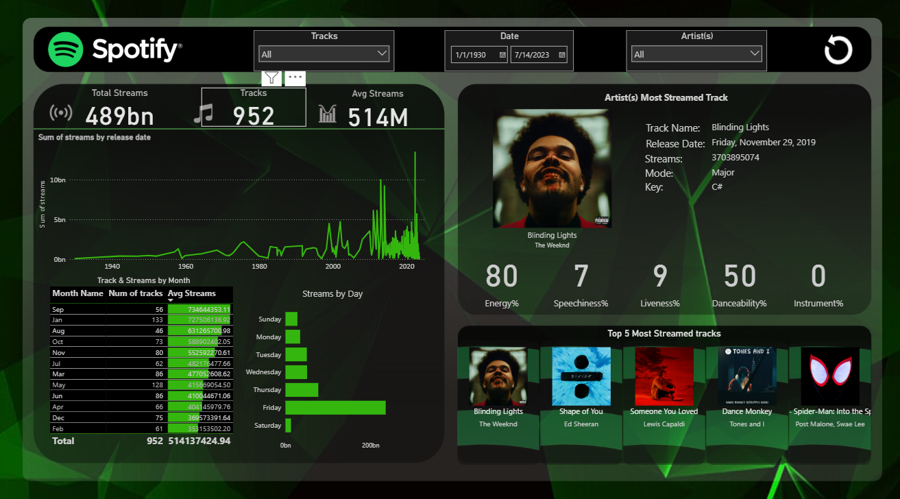

# Spotify Data Visualization Dashboard (Power BI)

This Power BI project explores Spotify track and artist data, providing a clean and interactive dashboard that displays song details, artist information, album images, and key metrics.

## Dashboard Features

- Displays track names and artist names
- Shows album cover images using image URLs
- Includes metrics like popularity, release year, and audio features
- Interactive filters for easier navigation and data exploration

## Project Files

- `spotify_updated_project.pbix` – Power BI report file
- `data + docs/spotify_with_links.csv` – dataset used
- 

## Tools and Technologies

- Power BI Desktop
- Power Query
- DAX
- Spotify dataset (from Spotify API * Kaggle)

## Notes

- The visuals are fully interactive and dynamically update based on slicers and filters.
- Album covers are rendered using URLs from the dataset.
- Data used is for educational and portfolio purposes only.

Regards, 
        **Rizwan bin Akbar**
